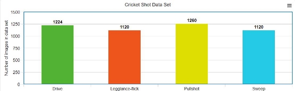
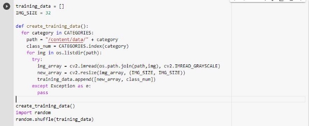
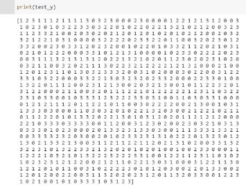
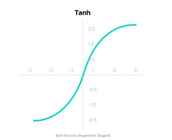
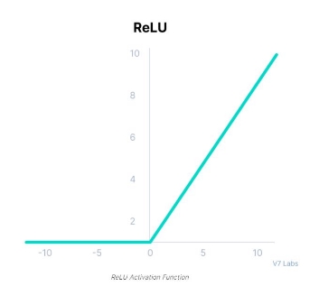
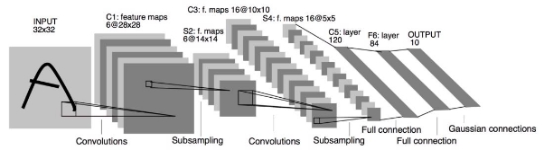
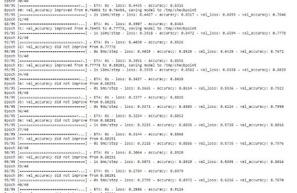
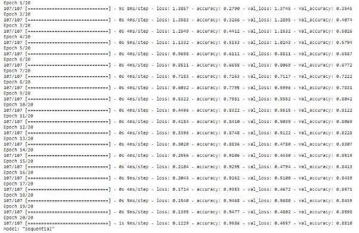
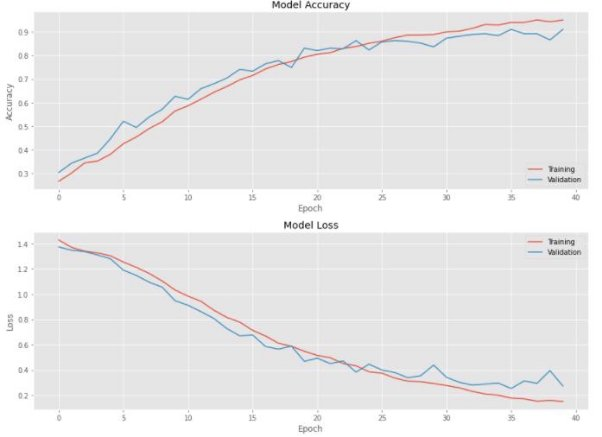



**CS4287 Convolutional Neural Network Assignment**

**Image classification of four different types of cricket shot.**

**Adam O’Sullivan (19265808) Bartlomiej Karas (19235305)**

Table of Contents

[**Table of Contents](#_page1_x72.00_y72.00) **[1** ](#_page1_x72.00_y72.00)[The Data Set](https://docs.google.com/document/d/1857RAa1NDpri4rxNz7QOEYoM8-_x5yWjpD8H6G57iKY/edit#heading=h.8he29gyuhu9n) 3 [Network Structure and Hyperparameters](https://docs.google.com/document/d/1857RAa1NDpri4rxNz7QOEYoM8-_x5yWjpD8H6G57iKY/edit#heading=h.hbgugxkc2of0) 6 [The Loss Function](https://docs.google.com/document/d/1857RAa1NDpri4rxNz7QOEYoM8-_x5yWjpD8H6G57iKY/edit#heading=h.jj9g3hqmksr3) 11 [The Optimiser](https://docs.google.com/document/d/1857RAa1NDpri4rxNz7QOEYoM8-_x5yWjpD8H6G57iKY/edit#heading=h.rr8ih58sc5cm) 12 [Results](https://docs.google.com/document/d/1857RAa1NDpri4rxNz7QOEYoM8-_x5yWjpD8H6G57iKY/edit#heading=h.wz43zftyh82i) 14 [Evaluation of the results](https://docs.google.com/document/d/1857RAa1NDpri4rxNz7QOEYoM8-_x5yWjpD8H6G57iKY/edit#heading=h.xcqw83u88wo0) 15 [Impact of Hyperparameters](https://docs.google.com/document/d/1857RAa1NDpri4rxNz7QOEYoM8-_x5yWjpD8H6G57iKY/edit#heading=h.5tttpq8w76ug) 17 [References](https://docs.google.com/document/d/1857RAa1NDpri4rxNz7QOEYoM8-_x5yWjpD8H6G57iKY/edit#heading=h.ki4n8k6gi8hi) 21**

**The Data Set**

The data set we used for our LeNet-5 Convolutional Neural Network is the “Cricket Shots Dataset”[1], which is a data set we found on Kaggle that contains 4724 images of four different cricket swings, a “drive”, a “legglance-flick”, a “pullshot”, and a “sweep”. Our goal was to train our Neural Network to recognise these different types of swings and to identify which of the four swings the image is showing. A human would be able to tell the difference between these based on the way the player is holding the racket and based on the player’s posture, we tried to mimic this within our Convolutional Neural Network.

  

Example of different images each from a different class.

We separated our data out into four different classes, each representing the type of shot in the image. The amount of images we had for each shot was quite similar, which was important for us as we did not want to create an imbalance that could potentially create a bias within our Convolutional Network, meaning it might favor a class that might come up more than the others.

Distribution of our cricket shot data set

Our classes in a list named “categories”

For our pre-processing stage, we scaled the images down in the dataset to be at a height of 32 pixels and a width of 32 pixels, this is the standard for Lenet-5 architecture and these are the dimensions of images that are passed into the next layer in the architecture. We also only used one channel, so we made all images greyscale, this was to simplify the algorithm and reduce computational requirements, as we do not need colour to identify the cricket shot in the image. We then shuffled all our data. This ensures that there is no bias due to the order in which the data was assembled, also reducing the possibility of overfitting.

Feeding a training\_data list our data set and then shuffling the data

  

Some images converted to greyscale 32\*32 images and fed into training\_data list. (displayed using plt.show())

We then created four different lists, in order to split our data into four different parts. We needed two data sets, training data and test data. This step is done in order to assure us that our results aren’t biased and that we don’t end up with a false impression of better model accuracy than what we actually have. The training data was the data that we used in order to teach our CNN, whereas the test data was used in order to evaluate our CNN in the end on data that it hasn’t seen yet (we also later created validation data in order to tune our hyperparameters, which we will talk about later.)

In the below image, we see that we created list train\_x for our training data, and as the data was shuffled, we then took twenty percent of training data and put it into test\_x, for our test data, hence our data was split eighty percent for training data, and twenty percent for test data.

Splitting data into training data and test data.

We also split all of our data into x and y, where x were the features of the input (the image itself), and y were the labels that each of the images had. We did this for One Hot Encoding as each image has one of four categories set earlier, hence:

label 0: drive

label 1: legglance-flick

label 2: pullshot

label 3: sweep

One-Hot-Encoding on test data set

At this point however, all of our features still had pixel values ranging from 0 to 256, each number representing a colour code.This still required quite a bit of computation as the numeric values were high and hence more complex. In order to reduce this, we normalized the values to be of range 0 to 1 so that the computation becomes easier and faster by dividing the data sets by 255.

Normalizing our data sets

**The Network Structure and Hyperparameters**

Our Network Structure was based on Lenet-5, and it was a sequential model, which essentially means that the CNN has an input of sequential data and then a number of predictions that the model makes, improving in predictions the more epochs it has.

Lenet-5 typically has five layers with learnable parameters, out of these, three layers are convolutional layers with a combination of average pooling (which replaces fully connected layers, returning the average of all values from the portion of the image covered by the Kernel). After these, we have two fully connected layers.

Each layer in the Lenet-5 architecture except for the output layer usually uses the Tanh activation function, where the larger the input is (the more positive), the closer the output will be 1.0, whereas the smaller input (the more negative), the closer the output value will be to -1.0.

[1] Graph of Tanh activation function.

6**
Mathematically, this is computed like this:

[1] Tanh Maths Equation.

While recognising that Tanh is the standard activation function, we did not opt to use it in our CNN, but we instead chose to use the ReLu activation function, which is a function that does not activate any neurons that have an output of less than zero. We did this due to the fact that the ReLu function is more computationally efficient than tanh as only a certain amount of neurons get activated, but it also accelerates the convergence of gradient descent towards the global minimum of the loss function due to it’s linear, non-saturating property, which we even seen while comparing the two activations, getting a 70% validation accuracy while using tanh, but a 85% validation accuracy while using ReLu.

[1] Graph of ReLu Activation Function.

[1]ReLu Maths Equation

The very last layer, the output layer, uses the Softmax function to give the probability that a data point belongs in one of the particular output neurons (classes). The highest value is then predicted.

[1] Softmax Maths Equation

[2]Diagram of Lenet-5 network architecture.

8**

The first layer that our CNN had was a convolutional layer with the following parameters:

- **Filters: 6**, (These help us in extracting specific features from our input data.)
- **kernel\_size: 5**, (This was the size of our filter, which was 5 by 5 pixels.)
- **Strides: 1**, (This means we only move one pixel per filter, which is appropriate for a 32 by 32 image.)
- **Activation: ReLu**, (Rectified Linear unit activation function.)
- **input\_shape: (32,32,1)**, (this means our shape is of height and width 32 pixels, and has only one channel as it is greyscale.)
- **padding: same**, (as we use a stride of 1 so the layer’s outputs will have the same spatial dimensions as its inputs.)

First Convolutional Layer

Next we had to essentially scale the matrix down using our average pooling layer, we made the pool\_size=(2,2) and we kept the strides at the default of 1. The way average pooling worked here, is that it took the average value of the four pixels that it was inspecting, and used that average to create a singular pixel. We used average pooling over Max Pooling or Min Pooling as our data varied in background colour, so the typical average pooling was the safest bet for us.

First Subsampling

We then had the same parameters for our second convolutional layer as we had for our first, with just a singular change which was the number of filters. We increased the number of filters to 16 as we want our CNN to capture more complex and hence larger patterns, in order to find more detail and learn what it is looking at.

Second Convolutional Layer

Fourthly, we scaled the matrix down again using our Average Pooling in the exact same way we scaled it the first time.

Second Subsampling

In our third and final convolutional layer, we once again kept the same parameters while increasing the filters to 120, this time to catch very specific features in each of the images.

Third Convolutional Layer

9**

In order to prepare for the final two layers which will be two fully connected dense layers, we had to flatten our input to be 1-dimensional.

Flattening our input

We could then pass our data onto the first fully connected dense layer which we set to have 84 neurons, we also used the ReLu activation for it.

Our fully connected Dense Layer

We then added a dropout layer in between this layer and our final output layer. We essentially did this to set a few random units to 0 while leaving the rest unmodified. We did this in order to prevent overfitting as without this we saw our training data reach accuracy of even 100% after about 17 epochs, which showed a sign of overfitting in our architecture. We applied a dropout of 20%.

Dropout of 20% before our final, output layer

Finally, we then pass everything onto the output layer, which is also a dense fully connected layer. We have 4 neurons in this layer as that is the amount of categories that we have within our data set. We use the activation function softmax here which as previously discussed calculates how certain the CNN is that a certain image represents a particular swing, selecting the one that it feels most confident is the correct one.

Output Layer

Within the model we also use the Loss Function “Categorical crossentropy” and the adam optimizer, both of which we will cover in later sections. One other thing worth mentioning within our model is that we perform a validation split of 10%, which essentially means that 90% of the data in the training\_data list will be used for training, while 10% will be used for validation, to ensure that the neural network has not just memorized our training data and to prove that it has actually learned meaning aspects of the data

Here is the way the code looked in full:

Network Structure Code

Here is a summary of the parameters in our Network Structure:

Parameter Summary

**The Loss Function**

The loss function we chose to use was Categorical Crossentropy. We chose this Loss Function because it can be used in multi-class classification tasks, which is what our CNN is doing, as our CNN is taking in an input and deciding which one out of four classes it belongs to. Categorical Crossentropy measures how different two probabilities are from each other, the probability of the correct output, and the probability of the other outputs. The sum for this is:

Categorical Crossentropy equation

In this equation, ^yi is the i-th scalar value in the model output and yi is the corresponding target value, whereas output size is just the amount of output neurons there are essentially. We used this Loss Function as it is effective and easy to understand, but also because it works very well with the Softmax activation function which we use in our output layer as the softmax activation perfectly rescales the model so that it has the right properties for our Categorical Crossentropy loss function.

**The optimiser**

The optimiser which we used for our neural network model was the adaptive moment estimation (adam). It is essentially a replacement optimization algorithm for stochastic gradient descent. We used adam as it is a popular and effective algorithm that is known to achieve good results fast. It combines the advantages of two extensions of stochastic gradient descent (SGD) which are Adaptive Gradient Algorithm(AdaGrad), and Root Mean Square Propagation (RMSProp). The way adam varies however is that instead of the learning rate being based on the average first moment as it is in RMSProp, adam also uses the average of the second moments of the gradients, calculating an exponential moving average of the gradient and the squared gradient. It keeps the moving averages close to 1 which is recommended among all Neural Network architectures and also keeps the bias of moment estimates towards zero. The bias is overcome by first calculating the biased estimates before then calculating bias-corrected estimates.

Adam’s configuration parameters include:

**Learning Rate:** The speed at which weights are updates (The bigger the learning rate, the faster the initial learning before the rate is updated, vice versa)

**Beta1:** The exponential decay rate for the first moment estimates.

**Beta2:** This is the exponential decay rate for the second-moment estimates. **Epsilon:** This is a very small number that prevents any division by zero in the implementation.

**Cross Fold Validation**

We have Cross Fold Validation in our CNN as well as Hold-Out.Cross Fold Validation in our neural architecture allows all of the data in the data set to be used in training at least once, and on validation at least once, which essentially allows us to estimate the network’s performance on unseen data. We split our data into 5 different splits so that for every iteration of the for-loop, the network uses a different subset of the training data for validation thus all of the training data will be used to train the model at one point or another by the time the loop ends.

Splitting our training data into training and validation data

We then set a checkpoint which allows us to save the best models and it’s weights, that way, we can load the best weights to continue the training from the saved state. We then train our model like normal but with the split up data, while also passing in the checkpoint as a callback.

Structure of K-Fold validation

Our accuracy ended up being lower and our loss higher due to overfitting being present in our CNN, which we will address further down in the document.

Our model in action

**Results:**

The results of our CNN were pretty positive in the end, definitely showing improvement after every epoch. We started off with a huge loss of 1.39 and an accuracy of only 0.28 for our training data, which was pretty expected considering the CNN had nothing to really work with at the start and was really guessing most of the results. The validation results on the first epoch were very similar with a 1.37 loss and a slightly better accuracy of 0.35, but definitely not something to be happy about.

The results did continuously improve on every epoch however, which was what we expected and a sign that our CNN was actually learning from it’s mistakes. After the 14th epoch, we already saw results of over 90% accuracy in our training data with a loss of around 0.25. Validation accuracy at that point was 85% also with our lowest loss of 0.44 which was also showing major improvement in the predictions that our CNN was making.

We ran 20 epochs, and on the 20th one we saw a loss of as low as 0.12 and an accuracy of as high as 96% on our training data, with a validation loss of 0.44 and accuracy of 88%. Overall we were happy with the results that our CNN was getting as the data set is a hard one to predict, even for a human who watches cricket, sometimes it’s hard to tell what kind of a swing the player is making just from an image so an 88% validation accuracy was amazing to see and showed machine learning.

Training our model, showing better predictions over epochs

Graph of our Model’s Accuracy

Graph of our Model’s Loss

**Evaluation of Results**

As earlier discussed, in our validation set, we managed to meet an accuracy of

over 88% after 20 epochs. This means after 100 swings of a racket, our CNN would accurately predict what kind of a hit 88 of the images are, which is probably better than the average human can predict which is a big success for us, however we do realize that it could have been even better, perhaps using a newer CNN architecture such as YOLO would have produced better results, it would be interesting to test this in our free time.

Our accuracy graph also shows that we prevented overfitting to a certain extent, (although or loss graph may disagree), and this is due to a lot of factors. Our data was big enough and spread out enough via shuffling as shown earlier for there not to be many biases within the Network. The images would all show up in a random order so that the CNN would not have a preferred category that it would go to if it wasn’t sure of the result.

Data augmentation also came into play, as not every single image was completely unique, however, some of the images were augmented in a manner that the data looked slightly different to the model, hence the data would appear unique to the model, preventing it from just memorizing it’s characteristics. Below we can see the exact same image presented twice, both being in the data set, however, it is augmented to the point that a CNN will not be able to look at the two of these and determine that they are both the same, even though a human can.

 

Data Augmentation shown within our data

Applying a dropout of 20% was also a big factor that prevented overfitting, as without this our training data was actually getting 100% accurate after about 16 epochs, which shows a lot of overfitting. Removing 20% of the pixels hence made for a more realistic guess, closer to what our validation accuracy was.

Our categorical cross entropy loss on the other does show that not all overfitting was removed, and we could have probably increased the amount of data we trained on to make this better. This started to become apparent about 8 epochs in, where the training data continued to drop in loss, but the validation stayed the same really. 0.45 loss is not great and we would have liked to have dropped that to at least less that 0.2 at least. We could have maybe further simplified the model too, reducing the number of parameters a bit as we had over 696,000 of them, or maybe even increasing the dropout rate a bit more.

We could have also maybe used a technique called ensembling, which would combine predictions from two or more separate models, such as boosting or bagging. Boosting would mean that we would train a large number of weak learners in a sequential model, so that each learner in the sequence would learn from the model before it. Boosting essentially combines all weak learners to bring out one strong learner, whereas bagging would train a large number of strong learners in parallel and combine them to optimize the prediction. These are common ways to reduce overfitting in a model.

We evaluated our data using our test dataset also, and we got a loss of 0.56 with an accuracy of 85%, which once again highlights that the loss is truthfully far too high, but the accuracy is still pretty impressive.

Evaluation on test data

Underfitting on the other hand was definitely not an issue in our neural network, as our neural network definitely showed improvement all the way throughout the epochs and it did not suddenly get worse at any point.

In conclusion, even with factors for preventing overfitting, overfitting still became apparent, and this was truthfully probably due to the size of our data set being a bit too small, but also the amount of parameters that we had. We will change the amount of filters in certain convolutional layers and also the amount of neurons in our final dense layer (before the output layer) to see whether it will change anything. The shape may have also came into play as a 32 by 32 pixel image with one channel can be hard to predict if the player is not a majority of the picture, so changing the shape may also work for reducing overfitting further.

**Impact of varying hyperparameters**

**Experiment 1: Tuning the dropout rate**

|**Model**|**Dropout**|**Accuracy**|**Loss**|**Val.Accuracy**|**Val.Loss**|
| - | - | - | - | - | - |
|1|20%|0\.9586|0\.1229|0\.8810|0\.4557|
|2|0%|1\.0000|0\.0014|0\.8519|0\.8174|
|3|40%|0\.9741|0\.0774|0\.8942|0\.3578|
|4|60%|0\.9618|0\.1073|0\.8942|0\.4166|

As seen in the table above, having no dropout rate at all will produce a big case of overfitting with a massive loss of over 0.81, despite the accuracy of the training data being 100%, hence, reducing the dropout rate would be terrible for our model. On the other hand however, increasing it from 20% to 40% actually gave us a better training data accuracy as well as better validation accuracy. It also dropped our training loss and our validation loss which highlights that perhaps increasing the dropout to 40% is a better number than our previous 20%. This increase only goes so far though, as increasing it to be 60% sees a drop in accuracy in both aspects as well as an increase in loss, although still being better than our original 20%. This highlights that 20% was not the best dropout rate to go for and increasing it would have given us better results.

**Experiment 2: Changing the shape of the input:**

|**Model**|**Image Size**|**Accuracy**|**Loss**|**Val.Accuracy**|**Val.Loss**|
| - | - | - | - | - | - |
|1|32\*32|0\.9586|0\.1229|0\.8810|0\.4557|
|2|64\*64|0\.9965|0\.0133|0\.8254|1\.0152|
|3|16\*16|0\.9112|0\.2545|0\.8228|0\.5481|

Both doubling the amount of pixels our input would have and halving them gave us worse results than our original 32\*32, hence changing this would make no sense, especially increasing the image makes it more complex hence causing massive overfitting. Changing the amount of channels from 1 to 3 also gave us no difference in the outputted results so it was better for less parameters and less computation to leave all images greyscale.

**Experiment 3: Changing the amount of filters**

|**Model**|**Filters**|**Accuracy**|**Loss**|**Val.Accuracy**|**Val.Loss**|
| - | - | - | - | - | - |
|1|Originally|0\.9586|0\.1229|0\.8810|0\.4557|
|2|Halved|0\.9418|0\.1499|0\.8333|0\.5605|
|3|Doubled|0\.9850|0\.0423|0\.8624|0\.5465|

Changing the amount of filters in this case didn’t seem to change too much, besides giving us worse results in every case, besides increasing our accuracy on the training data for doubling the filters. This reassured us that we used an alright amount of filters in each of our layers.

Halved Filters

Doubled Filters

**Experiment 4: Tuning the activation function on the dense layer**

|**Model**|**Activation**|**Accuracy**|**Loss**|**Val.Accuracy**|**Val.Loss**|
| - | - | - | - | - | - |
|1|ReLu|0\.9586|0\.1229|0\.8810|0\.4557|
|2|TanH|0\.9994|0\.0043|0\.8968|0\.5118|
|3|Sigmoid|0\.9882|0\.0513|0\.8810|0\.3575|

Upon tuning the activation function on the dense layer, we were right to not use the original TanH activation function as our results were very similar but showed even more overfitting, while the sigmoid function on the other hand showed the exact same validation accuracy, a better training data accuracy and a decrease in the validation loss, which means we should have considered the sigmoid function earlier as it was probably the better activation function on the dense layer.

**Experiment 5: Increasing the number of epochs during training**

|**Model**|**Epochs**|**Accuracy**|**Loss**|**Val.Accuracy**|**Val.Loss**|
| - | - | - | - | - | - |
|1|20|0\.9586|0\.1229|0\.8810|0\.4557|
|2|40|0\.9859|0\.0469|0\.9048|0\.3556|
|3|100|4\.7654e-04|1\.0000|0\.9286|0\.3314|

We see that increasing the number of epochs during training actually gave a reduction in our validation loss, which is a good thing for preventing overfitting a bit more, however the difference between 40 and 100 was rather small when it came to validation accuracy and validation loss, so perhaps 40 would be enough epochs in our case.

**Conclusion:**

We decided to apply all our experiments together at the end for one last result, just to see whether putting all these together would improve our model in anyway. Our changes are:

- Dropout - 40%
- Activation on Dense Layer - Sigmoid
- Epochs - 40

Result:

|**Accuracy**|**Loss**|**Val.Accuracy**|**Val.Loss**|
| - | - | - | - |
|0\.9497|0\.1516|0\.9101|0\.2732|

This actually gave us the best results we had yet and we were getting closer to no longer overfitting. The problem still exists however, and the next thing to do would probably be to get more data for training.

Our final results graph

**References:**

[1]*Activation functions in neural networks [12 types & use cases]*

*V7. Available at: [https://www.v7labs.com/blog/neural-networks-activation-functions#:~:text=Tanh%20F unction%20(Hyperbolic%20Tangent)&text=In%20Tanh%2C%20the%20larger%20the ,output%20will%20be%20to%20%2D1.0](https://www.v7labs.com/blog/neural-networks-activation-functions#:~:text=Tanh%20Function%20\(Hyperbolic%20Tangent\)&text=In%20Tanh%2C%20the%20larger%20the,output%20will%20be%20to%20%2D1.0).*

*[2]Pechyonkin, M. (2018) Key deep learning architectures: Lenet-5, Medium. Medium. Available at: https://medium.com/@pechyonkin/key-deep-learning-architectures-lenet-5-6fc3c59e 6f4 (Accessed: October 28, 2022).*
21**
